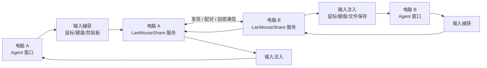
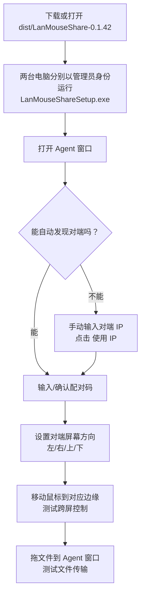

# LanMouseShare 0.1.42 项目说明与使用指南

LanMouseShare 是一个局域网内两台 Windows 电脑共享鼠标、键盘、剪贴板和文件传输的小工具。当前最终版 `0.1.42` 基于 `0.1.39 source-fixed` 功能线重新打包，重点保留稳定的跨屏控制、配对状态、快捷键和文件传输能力。

## 项目结构

```text
LanMouseShare
├─ src
│  ├─ Desktop.Agent      # 桌面端窗口、托盘、快捷键、鼠标键盘捕获与注入
│  ├─ Host.Service       # 后台服务，负责发现、配对、网络通信、文件流
│  ├─ Input.Native       # Windows 输入钩子、SendInput、边缘切屏检测
│  ├─ Shared.Core        # 协议、配置、加密、IPC DTO、控制状态
│  └─ Setup              # 单文件安装器
├─ scripts               # 安装服务、卸载服务、打包、日志、回退清理脚本
├─ docs                  # 包说明和手动测试说明
├─ tests                 # Shared.Core.Tests 控制逻辑测试
└─ dist                  # 各版本发布包
```

## 工作原理



核心链路是：

1. 两台电脑都安装并启动 Agent 和 Service。
2. Service 负责局域网发现、配对、加密通信和文件传输。
3. Agent 负责界面、键鼠捕获、跨屏判断、快捷键和本机输入注入。
4. 鼠标碰到配置方向的屏幕物理边缘并继续向外移动时，切换当前控制目标。
5. 当前控制目标是哪台电脑，两端键盘都应该输入到哪台电脑。

## 安装和首次使用



推荐安装方式：

1. 在两台电脑上分别运行 `dist\LanMouseShare-0.1.42\LanMouseShareSetup.exe`。
2. 安装器需要管理员权限，用于安装本地服务和配置防火墙。
3. 两台电脑都打开 Agent 窗口。
4. 等待自动发现对端。如果没有发现，就在“手动输入对端 IP”里填另一台电脑的 IPv4 地址。
5. 发起配对，并在另一台电脑上同意配对。
6. 设置对端屏幕方向，比如电脑 B 在电脑 A 右侧，就在 A 上选择“对端在右”。
7. 把鼠标移动到配置方向的屏幕边缘，即可跨屏。

## 主要功能

- 鼠标跨屏控制：不使用 12px 推入阈值，碰到配置方向物理边缘并继续向外移动即可切屏。
- 键盘跟随当前控制目标：当前目标是哪台电脑，两端键盘都输入到那台电脑。
- 剪贴板同步：支持文字和图片剪贴板同步，可在界面关闭。
- 文件传输：把普通文件拖到 Agent 窗口发送，对端保存到桌面 `Mouse传输文件` 文件夹。
- 配对保护：配对异常、设备 ID 不匹配、旧信任残留时会阻断跨屏输入。
- 边角阻挡：可开启“跨屏边角阻挡”，避免从屏幕角落误穿屏。
- 界面滚动：窗口内容过长时，中间设置区可用鼠标滚轮上下滚动。

## 快捷键

默认快捷键：

| 功能 | 默认快捷键 | 说明 |
| --- | --- | --- |
| 暂停/恢复跨屏 | `Ctrl+F11` | 暂停后键鼠、剪贴板、文件发送都停止 |
| 停止控制 | `Ctrl+F10` | 两端同时停止所有对端控制 |
| 关闭程序 | `Ctrl+Alt+End` | 退出 Agent |

快捷键可以在 Agent 界面的快捷键区域修改。

## 文件传输

使用方式：

1. 确认两端已配对并连接。
2. 把文件拖到 Agent 窗口。
3. 对端接收完成后，会保存到桌面：

```text
Mouse传输文件
```

注意：暂停状态、配对异常、未连接时不会开始新的文件传输。

## 回退和清理

如果要回退旧版本，先运行桌面脚本：

```text
LanMouseShare-Rollback-Clean.bat
```

这个脚本会：

- 关闭 Agent。
- 停止并删除 `LanMouseShare` 服务。
- 删除管理员计划任务 `LanMouseShare.Agent.Admin`。
- 删除开机自启动项。
- 删除安装版本注册表，避免老安装器跳到新版本。
- 把 `C:\Program Files\LanMouseShare` 移动备份。
- 把 `C:\ProgramData\LanMouseShare\config.json` 移动备份。

清理后再安装你想使用的旧版本。不要混用旧 Agent 和新 Service。

## 常见问题

### 老版本安装器一打开就跳到新版本

原因通常是系统里还残留：

```text
C:\Program Files\LanMouseShare
HKLM\Software\Microsoft\Windows\CurrentVersion\Uninstall\LanMouseShare
```

运行 `LanMouseShare-Rollback-Clean.bat` 后再安装老版本。

### 向日葵、Mouse without Borders 等远控软件窗口控制不了

这类软件可能主动过滤 Windows 的模拟输入事件。管理员权限不一定能解决，因为对方软件可能是为了防止远控套远控造成输入回环。当前建议是避开直接控制这类窗口，或在需要时先暂停 LanMouseShare。

### 两端显示配对状态不一致

建议：

1. 两台电脑都点停止控制或退出 Agent。
2. 运行回退清理脚本或手动清理配置。
3. 重新安装同一版本。
4. 重新配对。

### 关闭窗口后服务还在

如果没有开启“关闭窗口时最小化到托盘”，关闭 Agent 会请求本地服务退出。若仍残留，可运行：

```bat
net stop LanMouseShare
sc delete LanMouseShare
```

## 发布产物

当前最终版产物：

```text
dist\LanMouseShare-0.1.42\LanMouseShareSetup.exe
dist\LanMouseShare-0.1.42\LanMouseShare-0.1.42-source.zip
```

每次发布都建议保留独立版本目录，方便回退。
